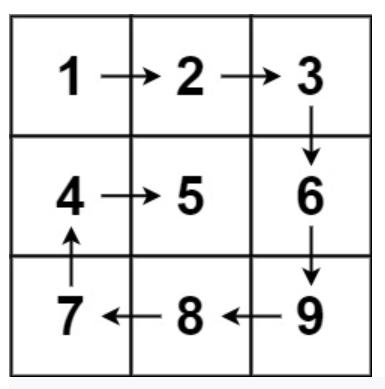

## Problem

https://leetcode.com/problems/minimum-path-sum/

## Problem Description

```
Given an m x n matrix, return all elements of the matrix in spiral order.

 
Example 1:


Input: matrix = [[1,2,3],[4,5,6],[7,8,9]]
Output: [1,2,3,6,9,8,7,4,5]
```

## Code

- Support Language: JAVA

```JAVA
class Solution {
    public List<Integer> spiralOrder(int[][] matrix) {
        List<Integer> ans = new ArrayList<>();
        
        if (matrix == null || matrix.length == 0) return ans;
        
        int m = matrix.length, n = matrix[0].length;
        int left = 0, right = n - 1, up = 0, down = m - 1;
       
        while(left <= right && up <= down) {
            for (int j = left; j <= right; j++) {
                ans.add(matrix[up][j]);
            }
            up++;
            
            for (int i = up; i <= down; i++) {
                ans.add(matrix[i][right]);
            }
            right--;
            
            if (up > down || right < left) break;
            
            for (int j = right; j >= left; j--) {
                ans.add(matrix[down][j]);
            }
            down--;
            
            for (int i = down; i >= up; i--) {
                ans.add(matrix[i][left]);
            }
            left++;
        }
                 
        return ans;      
    }
}
```
